# DOE Lab — Reference

**Design of experiments · Metamodeling · Multi-objective optimization**

A local desktop application that takes a study from factor definitions to a validated
Pareto front. Everything is Python, everything runs on your machine: no server, no
database, no browser.

| | |
|---|---|
| Workflow stages | 6 |
| Lines of Python | 9,604 |
| Tests | 214 |
| Response surfaces | 4 |
| Design types | 3 |
| Surrogate types | 3 |

> **New to design of experiments?** Start at [Chapter 16](#16--the-algorithms-in-plain-terms),
> which explains every algorithm and term used here from scratch, then come back to Chapter 1.

---

## Contents

**Part I — The application**
1. [Overview](#1--overview)
2. [The workflow, stage by stage](#2--the-workflow-stage-by-stage)
3. [The domain model](#3--the-domain-model)

**Part II — The methods**
4. [Designs of experiments](#4--designs-of-experiments)
5. [The solver library](#5--the-solver-library)
6. [Factor sensitivity](#6--factor-sensitivity)
7. [Partial R²](#ch7)
8. [Correlation](#8--correlation)
9. [The design explorer](#9--the-design-explorer)
10. [Metamodels](#10--metamodels)
11. [Optimization and validation](#11--optimization-and-validation)

**Part III — The implementation**

12. [Architecture](#12--architecture)
13. [The user interface](#13--the-user-interface)
14. [Testing](#14--testing)
15. [Limits and open questions](#15--limits-and-open-questions)

**Part IV — For newcomers**

16. [The algorithms in plain terms](#16--the-algorithms-in-plain-terms)
17. [Glossary](#17--glossary)

---
---

# Part I — The application

What it does, how the six stages depend on each other, and the vocabulary everything
else is written in.

---

## 1 · Overview

> **Summary**
>
> DOE Lab is a PySide6 desktop application for running a complete design-of-experiments
> study: define factors and responses, generate a design, evaluate it, analyse what
> drives what, fit surrogates, and optimise across competing objectives.
>
> The expensive physics solver a real study would call is replaced by a library of
> **analytic response surfaces** built from polynomial and trigonometric terms. The whole
> loop therefore runs in seconds, while still exhibiting the structure a DOE study exists
> to uncover: interior optima, factor interactions, and objectives that genuinely compete.
>
> The codebase is split in two — a **Qt-free engine** holding every calculation, and a
> thin PySide6 client over it. That boundary is asserted by a test, not just documented.

### Running it

```bash
.venv/Scripts/python -m doelab
```

```bash
.venv/Scripts/python -m pytest
```

### What it is for

A design of experiments answers a question that comes up whenever a simulation or a rig
is expensive to run: given a fixed budget of runs, where should they be placed, and what
can be concluded from the results? The workflow this app implements is the standard
industrial one — sample the space, fit a cheap surrogate to the samples, search the
surrogate, and then check the answer against the real thing.

Every part of that is real here except the solver. Substituting analytic surfaces is what
makes the app usable as a study tool rather than a batch job: a design that would take a
day of CFD returns instantly, so the interesting question becomes what the numbers *mean*
rather than how long they take.

### Dependencies

| Package | Role |
|---|---|
| PySide6 | Qt 6 bindings — the entire user interface |
| numpy / pandas | Every table and matrix in the engine |
| scipy | `qmc.LatinHypercube` for the space-filling design |
| scikit-learn | Linear, polynomial and Gaussian-process surrogates, cross-validation |
| pymoo | NSGA-II with native mixed-variable operators |
| pyqtgraph | Live plots — the Pareto dashboard and the parallel coordinates view |
| matplotlib | Static plots — scatter, contour, parity, bar |

Python 3.11 or newer. Packaged with hatchling; the console entry point is `doelab`.

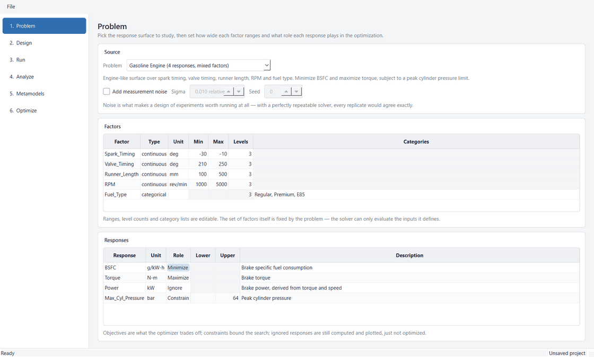

*Stage 1. The window is a numbered rail of six stages and one full-width page. A stage
becomes selectable only once its inputs exist.*

---

## 2 · The workflow, stage by stage

> **Summary**
>
> Six ordered stages. Each stage's output is the next one's input, which produces two
> rules that govern the whole application: a stage **unlocks** only once its prerequisites
> exist, and editing anything upstream **discards** what depended on it.
>
> Both rules are enforced in the engine — `Project.reached()` and
> `Project.invalidate_from()` — rather than left to the UI. Silently keeping results that
> no longer correspond to the current factors is the kind of bug that produces confident,
> wrong answers.

```
  1          2         3        4           5             6
Problem -> Design -> Run -> Analyze -> Metamodels -> Optimize
factors    design   results  summaries   surrogates    front
   ^                                          |
   +------- invalidate_from() ----------------+
            an edit here discards everything to its right
```

### The six stages

| Stage | Produces | What it is for |
|---|---|---|
| **1 · Problem** | `FactorSpace`, `[Response]` | Pick a response surface; set how wide each factor ranges and how many levels it has; give each response a role — minimize, maximize, constrain, or ignore. Optional measurement noise. |
| **2 · Design** | `design` DataFrame | Full Factorial, Latin Hypercube or D-Optimal. The scatter shows where runs actually land, which is the fastest way to see what a design type buys you. |
| **3 · Run** | `results` DataFrame | Evaluate the design and collect responses. Four headline tiles and a per-response summary. |
| **4 · Analyze** | — (read-only) | Four tabs: factor sensitivity, partial R², Pearson and Spearman correlations, and the parallel-coordinates design explorer. |
| **5 · Metamodels** | `{response: Metamodel}` | Fit Linear, Quadratic or Kriging surrogates per response, with cross-validated metrics and an interactive contour/sweep explorer. |
| **6 · Optimize** | `OptimizationResult` | NSGA-II over the surrogates with a live front and working Pause / Stop / Extend, then Validate against the real solver. |

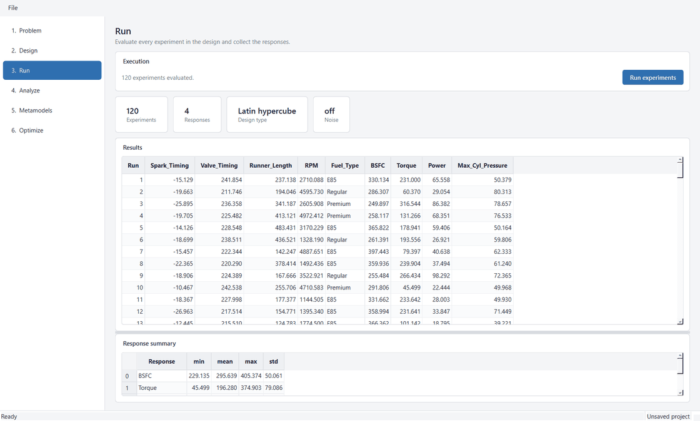

*Stage 3. The results table is the design and the responses side by side — one row per
run. That same frame is what the design explorer draws.*

### Gating

`Stage` is an `IntEnum` in dependency order, and `Project.reached(stage)` is a plain
predicate over what exists:

```
PROBLEM     factors is not None
DESIGN      factors is not None
RESULTS     has_design
METAMODELS  has_results
OPTIMIZE    has_metamodels
```

`Project.blocker(stage)` returns the same information phrased for a person — "Generate a
design first." — and the rail uses it as both the tooltip on a disabled row and the status
message if the row is clicked anyway. Naming the missing step is what makes the pipeline's
ordering teach itself rather than having to be read somewhere.

### Invalidation

The cascade is one method, and every page that mutates the project calls it:

```python
def invalidate_from(self, stage: Stage) -> None:
    if stage <= Stage.DESIGN:      self.design = None
    if stage <= Stage.RESULTS:     self.results = None
    if stage <= Stage.METAMODELS:  self.metamodels = {}
```

| User action | Invalidates from | Reasoning |
|---|---|---|
| Switch problem | `DESIGN` | Different factors and responses entirely; nothing downstream can survive. |
| Edit a factor range or level count | `DESIGN` | The design no longer samples the declared space. |
| Change noise settings | `RESULTS` | The design is still valid; its results were produced under the old setting. |
| Generate a new design | `RESULTS` | The old results describe runs that no longer exist. |
| Re-run the experiments | `METAMODELS` | Fitted surrogates describe the previous results. |
| Edit a response role or bound | — nothing | Roles affect only the optimization; results and fits stay valid. |

> **Why navigation locks while a stage works**
>
> Any page that starts background work calls `set_busy(True)`, and the window disables the
> whole rail until every page is idle. A stage that finished *after* the user had moved on
> would invalidate whatever they had since built — metamodels fitted against experiments
> that a late-arriving design had just replaced. Holding the user on the page that is
> working is what keeps that from happening.

---

## 3 · The domain model

> **Summary**
>
> Two factor types (continuous and categorical), one response type carrying an
> optimization role, and a `FactorSpace` that owns every translation between them.
>
> The space converts between three representations the rest of the engine works in:
> **unit-hypercube samples** (what samplers produce), **tabular factor values** (what the
> solver and surrogates consume), and **numeric coded matrices** (what design-optimality
> criteria and regressions need). Keeping all three conversions in one place is what lets
> mixed factor types work everywhere without each consumer re-deriving the encoding.

### Factors

| | `ContinuousFactor` | `CategoricalFactor` |
|---|---|---|
| Defines | A real interval `[low, high]` | An unordered (nominal) set of named levels |
| Fields | `low`, `high`, `unit`, `levels` | `categories`, `unit` |
| `level_values()` | `linspace(low, high, levels)` | the categories themselves |
| `from_unit(u)` | `low + u × (high − low)` | bin `[0,1]` into one equal stratum per level |
| `to_coded(v)` | scale to `[−1, 1]` | — expanded to indicator columns instead |

`levels` matters only to designs that discretize — full factorial, and the D-optimal
candidate set. Validation runs in `__post_init__`: a continuous factor's `high` must
exceed its `low` and it needs at least two levels; a categorical factor needs at least two
unique categories.

> **Why operating conditions are ordinary factors**
>
> Engine speed is modelled as a plain continuous factor rather than a separate "case"
> dimension. Tools wrapping an expensive physics solver keep that distinction because each
> operating point is another costly run — with an analytic solver it is a cost artifact
> rather than a mathematical one.

### Responses and roles

A response is a solver output. Its `role` is what turns a study into an optimization
problem:

| Role | Effect |
|---|---|
| `OBJECTIVE_MIN` | Minimized by the optimizer. Drawn with a ↓ on its explorer axis. |
| `OBJECTIVE_MAX` | Maximized. pymoo minimizes, so the search runs on the negation and the sign is undone before display. |
| `CONSTRAINT` | Must satisfy `lower` / `upper`. A response given this role with no bound raises at construction; the UI seeds `upper = 0.0` rather than letting an invalid response exist. |
| `IGNORED` | Computed, tabulated and plotted, but not optimized against. |

A two-sided constraint contributes *two* inequalities to the optimizer, which
`count_constraint_terms()` exists to get right.

### The coded matrix

`FactorSpace.coded_matrix(df, drop_first=True)` is the single encoding used by D-optimal
exchange, factor sensitivity, the variance decomposition, and the correlation tables.
Continuous factors are coded to `[−1, 1]`; categorical factors expand to indicator columns.

`drop_first` selects **reference coding** — the first category is left out and becomes the
baseline every other level is measured against. This is what keeps `XᵀX` non-singular once
an intercept is added, which D-optimal exchange and any least-squares fit both require.

Every column comes back as a `CodedColumn` carrying the factor it came from:

```python
@dataclass(frozen=True)
class CodedColumn:
    label: str          # "Fuel_Type=E85"
    factor: str         # "Fuel_Type"
    is_indicator: bool
```

That provenance is not bookkeeping. Callers building higher-order terms must know which
indicator columns are siblings, because indicators of one categorical factor are mutually
exclusive — their product is identically zero and would silently make `XᵀX` singular. It
is also what lets sensitivity and partial R² treat a categorical factor as *one* factor
rather than as its levels.

**Worked example — the gasoline engine space.** Five factors, one of them categorical with
three levels, gives eight coded columns under reference coding:

```
Spark_Timing      continuous  ->  1 column, [-1, 1]
Valve_Timing      continuous  ->  1 column
Runner_Length     continuous  ->  1 column
RPM               continuous  ->  1 column
Fuel_Type         3 levels    ->  2 columns   Fuel_Type=Premium
                                              Fuel_Type=E85
                                              (Regular is the baseline)
                                 ---
                                   6 columns + intercept
```

### Other space operations

| Method | Role |
|---|---|
| `from_unit_cube(u)` | Maps an `(n, d)` array of unit-cube samples to factor values — the bridge every sampler crosses. |
| `midpoint()` | A neutral sample: interval centres, and the first level of each categorical factor. The default "held at" point in the prediction explorer. |
| `continuous` / `categorical` | Typed partitions, used to build the one-hot / standardize column transformer for the surrogates. |
| `to_list` / `from_list` | Round-trips the whole space through plain dicts for the JSON project file. |

---
---

# Part II — The methods

What each calculation actually computes, what it is blind to, and how to read its output.
If you are new to DOE, read [Chapter 16](#16--the-algorithms-in-plain-terms) first — it
explains every algorithm named here in plain language.

---

## 4 · Designs of experiments

> **Summary**
>
> Three generators, each answering a different question. **Full factorial** takes every
> combination — exhaustive and perfectly balanced, but the run count multiplies out fast.
> **Latin hypercube** fills the space at a chosen size, stratifying every factor
> independently. **D-optimal** picks the subset of a candidate set that maximizes
> `det(XᵀX)` for an assumed model form.
>
> D-optimal is the one to reach for with mixed factor types and a fixed run budget. It uses
> Fedorov point exchange with a **rank-one update** of `(XᵀX)⁻¹`, evaluating the whole
> exchange matrix per iteration rather than refactorizing a determinant per candidate pair.

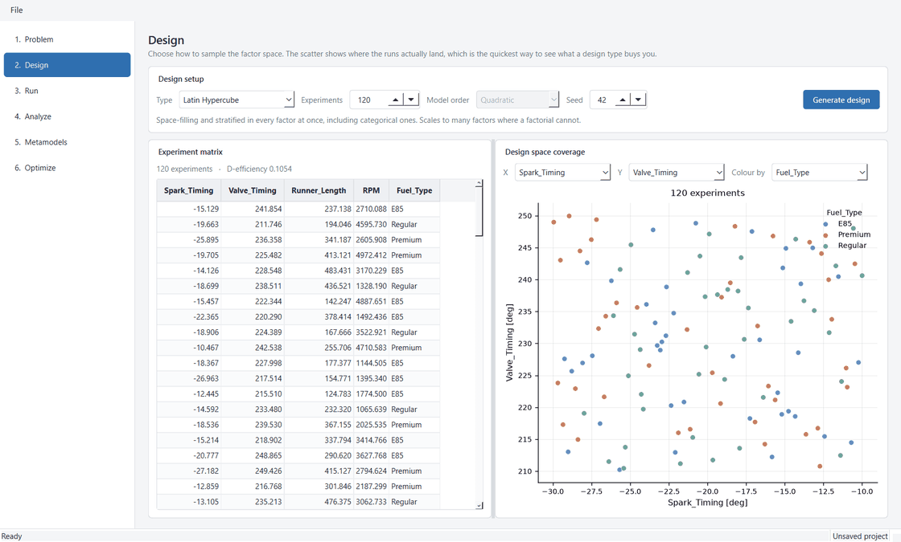

*Stage 2. Controls a design type does not use are disabled rather than hidden, and the
hint line under them changes to describe the selected type. The scatter colours by any
categorical factor.*

### Full factorial

The Cartesian product of every factor's `level_values()`. Continuous factors contribute
`levels` evenly spaced values; categorical factors contribute their categories.
`full_factorial_size()` computes the row count without building the frame, which lets the
UI warn before generating something enormous — over 5,000 runs it asks for confirmation.

For the gasoline engine at three levels per continuous factor: `3 × 3 × 3 × 3 × 3 = 243`
runs. Raise any factor to five levels and it is 405. This growth is the entire argument for
the other two designs.

### Latin hypercube

Built on `scipy.stats.qmc.LatinHypercube`, which produces a unit-cube sample stratified in
every dimension: each factor's range is cut into `n` equal bins and every bin gets exactly
one point.

> **Categorical stratification**
>
> The usual way categorical factors get handled in an LHS is random assignment, which
> throws away the stratification guarantee on those columns. Here
> `CategoricalFactor.from_unit` bins the LHS coordinate into **one equal stratum per level**
> instead, so proportional coverage falls straight out of the LHS permutation:
>
> ```python
> k = len(self.categories)
> idx = np.clip((u * k).astype(int), 0, k - 1)
> return np.asarray(self.categories, dtype=object)[idx]
> ```

LHS stratifies each factor *independently*. It does not orthogonalize them — a fact that
returns in [Chapter 7](#ch7), where residual correlation between factor columns
is what makes unique contributions over-count.

### D-optimal

The criterion is `det(XᵀX)` for a chosen model form, maximized over which candidate points
to include. `_model_matrix()` assembles `X`: an intercept, the coded main effects, and for
a quadratic model the pairwise interactions plus squared terms for the continuous factors.

**The two degenerate column families.** Two kinds of column are deliberately excluded, both
of which would make `XᵀX` singular for *every possible design*:

- **Squares of indicators.** For a 0/1 column, `x² == x` — the square is an exact duplicate
  of the column it came from.
- **Interactions between indicators of the same categorical factor.** Those levels are
  mutually exclusive, so their product is identically zero: an all-zero column.

```python
blocks.extend(
    (coded[:, i] * coded[:, j]).reshape(-1, 1)
    for i in range(p) for j in range(i + 1, p)
    if not (columns[i].factor == columns[j].factor)
)
blocks.extend(
    (coded[:, i] ** 2).reshape(-1, 1)
    for i in range(p) if not columns[i].is_indicator
)
```

This is why `CodedColumn` carries its parent factor — without it, neither exclusion can be
expressed.

**The candidate set.** Exchange has to choose from somewhere. When the discretized grid is
small enough to enumerate it is used exactly, since exchanging over the true grid gives the
cleanest designs. Otherwise continuous factors are sampled and snapped to a level set,
keeping candidates well spread without enumerating an intractable product. Defaults: 2,000
candidates at 7 levels per continuous factor.

**Fedorov exchange with a rank-one update.** From a random non-singular start, repeatedly
swap the design point whose replacement most improves the criterion, until no swap helps.
Swapping design row `i` for candidate `j` changes the determinant by a factor
`1 + δ(i, j)`:

```
δ(i,j) = (1 + vⱼ)(1 − dᵢ) + cᵢⱼ² − 1
```

where `dᵢ` and `vⱼ` are the leverages of the design and candidate rows and `cᵢⱼ` is their
cross term. Computing it this way costs **one `(n × n_cand)` product per iteration** instead
of refactorizing a determinant for every pair:

```python
A = X @ M_inv
d_i = np.einsum("ij,ij->i", A, X)
B = X_all @ M_inv
v_j = np.einsum("ij,ij->i", B, X_all)
cross = A @ X_all.T

delta = (1.0 + v_j[None, :]) * (1.0 - d_i[:, None]) + cross**2 - 1.0
delta[:, idx] = -np.inf   # forbid points already in the design
```

> **Two decisions worth naming**
>
> **Replicates are forbidden.** Repeated runs are legitimate in classical D-optimal design,
> where they buy an estimate of pure error. This solver is deterministic, so a repeated row
> would return an identical value and simply waste part of the run budget.
>
> **The start must be non-singular.** Exchange cannot climb away from `−∞`, so a
> rank-deficient start would stall the search immediately. `_random_nonsingular_start` draws
> up to 200 times looking for full rank.

Five random restarts guard against the local optima the greedy scheme settles into; the
best-scoring design wins. The search refuses upfront to produce a design smaller than the
model has terms, with an error naming both numbers.

### D-efficiency

Shown under the experiment matrix as a single number, scale-free in the number of terms so
designs with different run counts stay comparable:

```
D-eff = det(XᵀX)^(1/p) / n
```

It is computed inside a bare `try` and dropped silently on failure — a rank-deficient
design should still show its matrix.

---

## 5 · The solver library

> **Summary**
>
> Four registered problems behind one `Problem` abstract base: each declares its factors and
> responses and evaluates a whole design at once. Selecting a problem is what populates the
> factor and response tables.
>
> The **gasoline engine** is the flagship — four responses over five factors including a
> categorical fuel choice, deliberately built so its objectives compete and its constraint
> binds. The other three are standard benchmarks with known answers, which is what makes
> them useful as tests.

### The Problem interface

```python
class Problem(ABC):
    name: str; title: str; description: str

    def make_factors(self) -> list[Factor]: ...
    def make_responses(self) -> list[Response]: ...
    def compute(self, df) -> dict[str, np.ndarray]: ...

    def evaluate(self, df, noise=None) -> pd.DataFrame:
        # compute(), then optionally corrupt
```

### The gasoline engine

Factors: `Spark_Timing −30…−10 deg` · `Valve_Timing 210…250 deg` ·
`Runner_Length 100…500 mm` · `RPM 1000…5000` · `Fuel_Type {Regular, Premium, E85}`

| Response | Unit | Role |
|---|---|---|
| BSFC | g/kW-h | minimize |
| Torque | N-m | maximize |
| Power | kW | ignored (derived from torque and speed) |
| Max_Cyl_Pressure | bar | constraint, `≤ 64` |

**The structure that was designed in:**

- **Spark timing has a best-torque value (MBT) that advances with octane.** This is the
  interaction that makes `Fuel_Type` matter rather than being a flat offset.
  `mbt = 0.45 + 0.13 × octane`.
- **Best economy sits retarded of MBT** — `best_economy = mbt − 0.14`. Because the two
  optima do not coincide, BSFC and Torque are genuinely in tension rather than peaking
  together. That tension is what gives the optimizer a non-trivial Pareto front.
- **Runner length and RPM interact through an intake-resonance ridge.** A cosine term
  `cos(2π(ℓ − 0.55n − 0.20))` puts a tuned diagonal band across that plane, so the torque
  contour over the pair is a ridge rather than a bowl.
- **The cam-phasing optimum drifts later with engine speed** — `vt_opt = 0.40 + 0.30n`,
  another honest interaction.
- **E85 trades economy for output.** Relative energy 0.72 (so more fuel for the same work,
  raising BSFC) but octane 1.35, allowing more spark advance.

> **Why BSFC is additive rather than a reciprocal**
>
> BSFC is written as a base rate plus bounded penalties for operating away from the
> efficiency island, divided by the fuel's relative energy. Expressing it as `1/efficiency`
> instead blows up wherever the efficiency terms stack at their floor — producing corner
> values no engine would show, and a surface dominated by that corner rather than by the
> physics.

> ⚠️ **The constraint is set where it binds**
>
> `Max_Cyl_Pressure ≤ 64` was chosen deliberately: peak pressure rises with spark advance
> almost in lockstep with torque, so this limit cuts the high-output end of the front rather
> than sitting inactive. The consequence is visible in the design explorer — a 120-run LHS
> puts **66 of 120 designs** outside it, so the plot is mostly red. See
> [Chapter 15](#15--limits-and-open-questions).

### The benchmarks

| Problem | Shape | What it is good for |
|---|---|---|
| **Branin-Hoo** | 2 factors, 1 objective | Three equal global minima at a known value of 0.397887. A linear model explains **4%** of it, which makes it the sharpest demonstration of what the fit-quality measures are for. |
| **Rosenbrock** | 2 factors, 1 objective | A narrow curved valley minimized at `(1, 1)`; easy to find, hard to converge in. |
| **ZDT1** | 6 factors, 2 objectives | An analytic Pareto front, `f2 = 1 − √f1`. The known answer is what lets a test assert the optimizer actually converges rather than merely runs. |

### Noise

Optional multiplicative Gaussian noise: `value × (1 + N(0, σ))`. Relative rather than
absolute, so one setting is meaningful across responses whose magnitudes differ by orders of
magnitude. A fixed seed makes a given design reproducible, and the generator is created once
per `evaluate` call.

It is off by default and worth turning on: real DOE practice exists largely *because*
observations are noisy, and with a perfectly repeatable solver every replicate agrees
exactly.

---

## 6 · Factor sensitivity

> **Summary**
>
> Squared standardized regression coefficients, **normalized to sum to 1** across factors.
> A linear model is fitted on the coded factor matrix with every column standardized, so
> each coefficient sits on a common scale; squaring makes the contributions additive in the
> same sense variance is; normalizing turns them into shares readable as percentages.
>
> Its strength is ranking. Its weakness is that normalizing divides the model's own R² out
> *by construction* — a row looks identical whether the fit explains 95% of the response or
> 4%. That is precisely what [Chapter 7](#ch7) exists to restore.

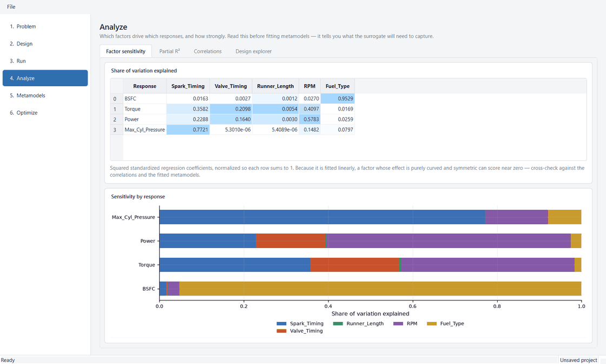

*Rows are responses, columns are factors. Every row sums to 1.000, so the stacked bar
always fills.*

### The calculation, one step at a time

1. **Code the factors.** `coded_matrix(drop_first=True)` gives `X`: continuous columns on
   `[−1, 1]`, categorical factors as indicator columns.
2. **Standardize every column.** Subtract the mean, divide by the standard deviation.
   Without this, a coefficient's size would depend on the units its factor happens to be
   measured in — a factor in millimetres would look a thousand times more important than the
   same factor in metres. Columns that never vary are zeroed rather than divided by zero.
3. **Standardize the response** the same way.
4. **Fit.** `np.linalg.lstsq(Xs, ys)` returns one `β` per column. These betas are exactly
   what they sound like: the weight each factor carries in the best straight-line prediction
   of the response, all on one common scale.
5. **Square and pool.** Each `β²` is added into its parent factor's total, so a categorical
   factor's several indicator columns collapse into a single figure for the factor.
6. **Normalize.** Divide each factor's total by the sum across factors.

```python
per_factor = {name: 0.0 for name in space.names}
for coefficient, column in zip(beta, columns):
    per_factor[column.factor] += float(coefficient) ** 2

total = sum(per_factor.values())
if total > 0:
    per_factor = {k: v / total for k, v in per_factor.items()}
```

> **Why rows always sum to exactly 100%**
>
> For standardized inputs and output, `Σβ² ≈ R²`. Step 6 divides by that sum — so it
> divides R² out. The rows summing to one is not a property of the data; it is an identity
> created by the last line of the function.

### Reading the shading

The table uses the `"sequential"` shading mode, which scales each column over **its own**
min-to-max range. Pale is that column's smallest value, saturated blue its largest.

> ⚠️ **A known mis-scaling**
>
> Every cell in this table is already a normalized share on a common 0–1 scale, so rescaling
> per column destroys the comparability it was built for. The visible symptom: **every
> column always contains exactly one pure-white and one full-blue cell**, regardless of
> whether its values span 0.001–0.9 or 0.24–0.26. A share of 0.15 can appear darker than one
> of 0.57 in the next column along. The [partial R²](#ch7) table added later uses a
> fixed 0–1 ramp for exactly this reason; the fix has not been applied back to this tab.

### The documented blind spot

The measure inherits the linear model's blind spot: **a factor whose effect is purely
quadratic and symmetric about the design centre scores near zero despite mattering.** The
best straight line through a symmetric parabola is flat, so its `β` is ~0.

This is asserted as a test rather than merely noted, so it cannot regress into a silent
wrong answer:

```python
response = pd.DataFrame({"y": (design["a"] - 0.5) ** 2})
shares = analysis.factor_sensitivity(space, design, response).loc["y"]
assert shares["a"] < 0.2
```

Read it alongside the correlation tables and the fitted metamodels rather than on its own.

### Reference values

Gasoline engine, 120-run LHS at seed 42:

| Response | Spark_Timing | Valve_Timing | Runner_Length | RPM | Fuel_Type |
|---|---:|---:|---:|---:|---:|
| BSFC | 0.016 | 0.003 | 0.001 | 0.027 | 0.953 |
| Torque | 0.358 | 0.210 | 0.005 | 0.410 | 0.017 |
| Power | 0.229 | 0.164 | 0.003 | 0.578 | 0.026 |
| Max_Cyl_Pressure | 0.772 | 0.000 | 0.000 | 0.148 | 0.080 |

Read on its own, the Torque row says RPM (0.410) and Spark_Timing (0.358) dominate.
Chapter 7 shows that the model those shares come from explains 24% of Torque.

---

<a id="ch7"></a>

## 7 · Partial R²

> **Summary**
>
> Each factor is **dropped from the model and the model refitted**; what the fit loses is
> what that factor was uniquely providing. Nothing is normalized, so two things sensitivity
> hides become visible: how much the model explains at all, and how much of what it explains
> cannot be booked to any single factor.
>
> Three numbers come out of one pair of residual sums of squares. **Partial R²** asks: of
> the variation the other factors leave unexplained, how much does this one recover?
> **Semi-partial R²** asks: how much of the whole response does it own uniquely? The
> difference between their total and R² is **shared** — explained, but not attributable.

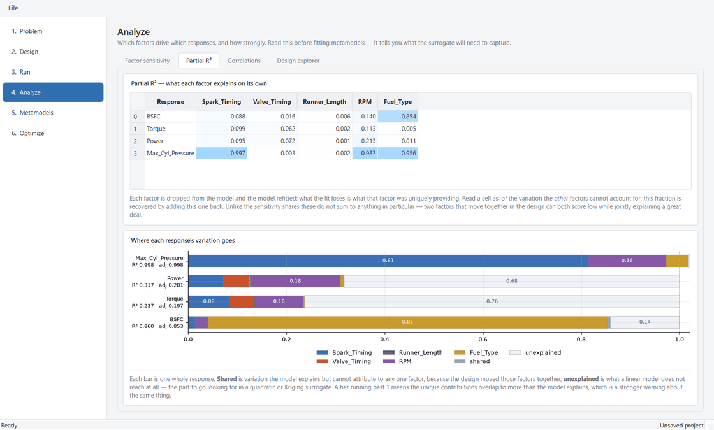

*Each bar is one whole response. The grey tail is the part the sensitivity chart next door
cannot show, because it renormalizes the coloured segments to fill the bar.*

### The formulas

```
SST         = Σ(y − ȳ)²
SSE_full    = residual of  y ~ intercept + all factors
SSE_reduced = residual of  y ~ intercept + all factors EXCEPT j

R²          = 1 − SSE_full / SST
partialⱼ    = (SSE_reduced − SSE_full) / SSE_reduced
semiⱼ       = (SSE_reduced − SSE_full) / SST

unique      = Σⱼ semiⱼ
shared      = R² − unique
unexplained = 1 − R²
```

The last three partition the response: `unique + shared + unexplained == 1`, exactly, which
is what makes the stacked bar a true partition rather than a stack of loosely related
quantities.

```
ONE RESPONSE, TOTAL VARIATION = 1
|<--------------- R² ---------------->|
| factor A | factor B | factor C |shrd|      unexplained (1 − R²)      |
|<------ unique (semi-partial) ------>|
```

### Implementation notes

```python
design = np.column_stack([np.ones(n_runs), X])
owners = [c.factor for c in columns]

for name in space.names:
    keep = [0] + [i + 1 for i, owner in enumerate(owners) if owner != name]
    residual_reduced = _residual_sum_of_squares(design[:, keep], y)
    gain = max(residual_reduced - residual_full, 0.0)
    partial[name] = gain / residual_reduced if residual_reduced > _EPS else 0.0
    unique[name]  = gain / total
```

| Detail | Reasoning |
|---|---|
| **intercept** | Sits in column 0 and is **never** dropped. Every reduced model must still be free to fit the response's mean, or the "loss" from removing a factor would include the mean it was absorbing. |
| **categoricals** | Dropped **whole** — every indicator column at once, via `owners`. Removing one level at a time would understate the factor, since the remaining indicator still carries part of the same contrast. |
| **gain clamp** | Dropping columns cannot reduce the residual in exact arithmetic, so `max(…, 0.0)` only catches float wobble. |
| **residual** | Computed from the fitted values, not read off `lstsq`'s own residual return — that comes back **empty** whenever the matrix is rank-deficient, which is exactly the confounded design this measure exists to expose. |
| **adjusted R²** | `1 − (1−R²)(n−1)/(n−p−1)`, and `NaN` once `n − p − 1 ≤ 0` — the point at which an unpenalized R² is at its most flattering. |
| **constant response** | Shares are 0.0 so the table stays numeric; the fit is `NaN` so it reads as absent. R² is undefined without variation, not zero. |

### Reference values

Same study — gasoline engine, 120-run LHS at seed 42.

**Partial R²**

| Response | Spark_Timing | Valve_Timing | Runner_Length | RPM | Fuel_Type |
|---|---:|---:|---:|---:|---:|
| BSFC | 0.088 | 0.016 | 0.006 | 0.140 | 0.854 |
| Torque | 0.099 | 0.062 | 0.002 | 0.113 | 0.005 |
| Power | 0.095 | 0.072 | 0.001 | 0.213 | 0.011 |
| Max_Cyl_Pressure | 0.997 | 0.003 | 0.002 | 0.987 | 0.956 |

**Model fit**

| Response | R² | Adjusted | Unique | Shared | Unexplained |
|---|---:|---:|---:|---:|---:|
| BSFC | 0.8604 | 0.8530 | 0.8542 | 0.0062 | 0.1396 |
| Torque | 0.2371 | 0.1966 | 0.2375 | −0.0004 | 0.7629 |
| Power | 0.3173 | 0.2810 | 0.3177 | −0.0004 | 0.6827 |
| Max_Cyl_Pressure | 0.9979 | 0.9978 | 1.0185 | −0.0206 | 0.0021 |

> ✅ **The finding this tab was built to surface**
>
> **Torque's linear model explains 24% of it.** The sensitivity tab shows RPM at 0.410 for
> Torque, which reads as a large share of the response — it is 41% of a model that reaches
> almost none of it. Power is the same story at R² 0.317. BSFC is the row that holds up:
> R² 0.860, with Fuel_Type owning 0.815 of it *uniquely*.

### When a bar runs past 1

`Max_Cyl_Pressure`'s unique contributions sum to 1.0185 against an R² of 0.998, so `shared`
is **negative**. A stacked bar cannot render a negative segment in a partition, so the chart
widens its axis and marks 1.0 with a dashed rail rather than clipping — the overflow reads
as the finding it is.

This is genuine suppression, not a defect. ZDT1 shows it far more strongly, and the check is
decisive:

```
max |corr| among coded factor columns: 0.213
R2 = 0.9846
semi-partials: [0.261 0.174 0.190 0.189 0.168 0.176]  sum: 1.1585
orthogonalized sum: 0.9846   vs R2 0.9846
```

Orthogonalizing the same columns collapses the excess to exactly R². Latin hypercube
sampling stratifies each factor independently but does not orthogonalize them, so at
moderate run counts the columns retain real correlation — here enough to push the uniques
17% past R². That identity is asserted in the tests as
`test_an_orthogonal_design_leaves_nothing_shared`.

### Shading

This table uses a third shading mode, `"fraction"`, added for it: a fixed white-to-blue ramp
over `[0, 1]`. These numbers are absolute, so a dark cell must mean "large" everywhere in the
table rather than "largest in this column". It is the correction the sensitivity tab still
wants.

---

## 8 · Correlation

> **Summary**
>
> Pearson and Spearman correlations across all factors and responses together. Both are
> reported because **they disagree informatively**: where Spearman is strong but Pearson
> weak, the relationship is monotonic but curved — a direct signal that a linear metamodel
> will not be enough.
>
> Correlation is inherently **pairwise**. It scales by repetition, not generalisation: each
> cell is an independent calculation on two columns and knows nothing about the others. That
> is its robustness and also its blind spot — it cannot tell a real effect from a coincidence
> produced by a confounded design.

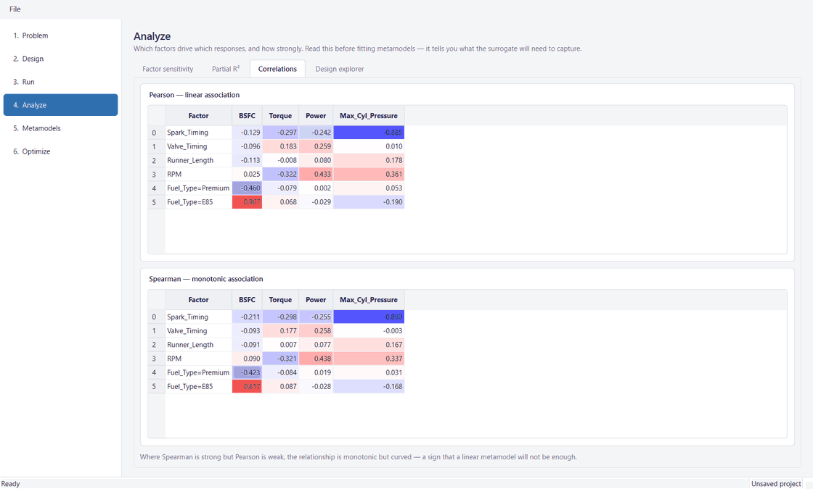

*Blue is negative, red positive, white at zero — a fixed scale over `[−1, 1]`, because here
the sign carries as much information as the magnitude.*

### The calculation, one step at a time

For one factor column `x` and one response column `y`:

1. Subtract the mean from `x`, giving `dx` for every run. Do the same for `y`.
2. Multiply the pairs: `dx × dy` per run. Positive where both sit on the same side of their
   averages, negative where they are on opposite sides.
3. Add those products up. A large positive total means they move together.
4. Divide by `√(Σdx² · Σdy²)`. This is the step that removes the units and pins the result
   into `[−1, 1]`.
5. For **Spearman**: do all of the above on the *ranks* instead of the values. Rank 1 for the
   smallest, 2 for the next, and so on. A curved but always-rising relationship has perfectly
   matching ranks even though its raw values do not sit on a line.

### Categorical expansion

A correlation is only defined against a numeric variable, so categorical factors are expanded
to indicator columns; each reads as "this level versus the rest". Constant columns have
undefined correlation and are dropped rather than emitting a table full of `NaN` that reads
as a failure.

> ⚠️ **The baseline level is hidden**
>
> This tab calls `coded_matrix(drop_first=True)`, which omits the first category. There is no
> matrix inversion here, so nothing requires it — and dropping it hides a real finding.
> Regular (−0.4462) and Premium (−0.4604) behave near-identically against BSFC while E85
> (+0.9066) is the whole effect; with Regular hidden, the reader sees only two of the three
> numbers that make that clear. Listed in [Chapter 15](#15--limits-and-open-questions).

### What is computed versus what is shown

For the gasoline study the app computes the full square and displays one block of it:

```
10 columns (6 coded factor columns + 4 responses)  ->  100 cells
   factor x response   6 x 4 = 24   <- shown
   factor x factor          36         design structure, not a finding
   response x response      16         hidden
```

The hidden response-vs-response corner answers a question the rest of the app is built
around:

| | BSFC | Torque | Power | Max_Cyl_Pressure |
|---|---:|---:|---:|---:|
| BSFC | 1.000 | −0.235 | −0.189 | −0.011 |
| Torque | −0.235 | 1.000 | 0.666 | 0.141 |
| Power | −0.189 | 0.666 | 1.000 | 0.410 |
| Max_Cyl_Pressure | −0.011 | 0.141 | 0.410 | 1.000 |

BSFC is minimized and Torque maximized, and they correlate at **−0.235** — the two goals
genuinely fight. That is the empirical justification for running a multi-objective optimizer
at all: were it strongly positive, one design would win on both and there would be no front
to compute. Torque and Power at **+0.666** say the opposite, which is why leaving Power out of
the objectives costs little.

### The limitation, demonstrated

Because each cell is blind to the other factors, correlation cannot distinguish a real effect
from a coincidence. Construct `x2` as pure shadow — it tracks `x1` closely and has *zero*
effect on the response, which is exactly `y = 3x₁`:

```
x1 and x2 correlate with each other:  r = 0.983

correlation says   x1 -> y :  1.000
correlation says   x2 -> y :  0.983     <- looks powerful, is fiction

regression beta    x1     :  1.000
regression beta    x2     :  0.000     <- correctly nothing
sensitivity share  x2     :  0.0
```

Correlation hands `x2` a score of 0.983 because, viewed two columns at a time, it really does
rise and fall with `y`. It just does so by riding along with `x1`. Only a calculation that
sees all factors at once can strip that out.

The same phenomenon explains a number that would otherwise look like an error: **BSFC's
marginal r² values sum to 1.0339** — over 100%. Pairwise measures double-count shared
variation.

> **Why the app carries all three**
>
> **Correlations** answer 24 separate two-column questions: cheap, robust, sign-carrying, and
> blind to overlap. **Sensitivity** answers one six-column question per response, where every
> factor competes for credit simultaneously. **Partial R²** answers the same question but
> keeps the totals, so the overlap it strips out stays visible as `shared`. The trade runs
> both ways in fairness — when two factors are almost perfectly redundant the regression
> cannot decide between them either, and its betas turn unstable.

---

## 9 · The design explorer

> **Summary**
>
> A parallel coordinates plot: one vertical axis per variable, one polyline per design. Where
> the other analysis tabs collapse the study to one number per factor-response pair, this
> keeps the individual runs — which is what makes the runs that *disagree* with a trend
> findable.
>
> Three rules govern reading it. Only **adjacent** axes carry information, so reordering is
> the main analytic action rather than a cosmetic one. Filtering **fades rather than hides**.
> And axes are scaled to the **data**, not to declared factor ranges.

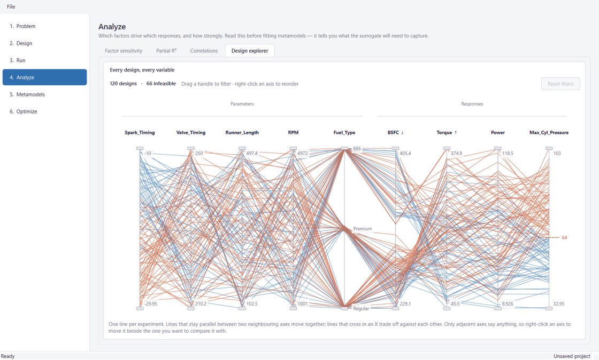

*The gasoline study: 120 designs, 66 of them infeasible against `Max_Cyl_Pressure ≤ 64` and
therefore drawn in red. The dashed rail on the last axis is that bound, taken straight from
the response definition.*

### How to read it

- **Parallel lines between two neighbouring axes** mean the variables move together.
- **Lines crossing in an X** mean they trade off.
- **Non-neighbouring axes say almost nothing.** Nine axes have 36 pairs; the default
  factor-then-response order exposes only eight of them. Right-clicking an axis to move it
  beside the one you want to compare against is therefore the primary action, not a nicety.

### Brushing

Dragging either handle on an axis brushes it to a range. Several brushed axes **intersect**,
so filters stack into a region of the design space rather than accumulating one.

> **Fade, don't hide**
>
> Designs outside the bands stay on the plot in pale grey. The excluded designs are the
> context that gives the surviving ones meaning — "these twenty" says little without the
> hundred they were chosen from — and it keeps widening a band an obviously reversible act
> rather than something that looks like it recovers deleted data.

### Filters versus constraints

These are kept strictly separate, in the engine as well as visually: `filter_mask()` is the
user's question, `feasibility()` is the problem's own rule. Conflating them would let widening
a filter appear to make an infeasible design acceptable. A design breaking a constraint is
drawn red whether or not it passes the brushes.

`feasibility()` uses `TOLERANCE = 1e-9` — deliberately the same tolerance the optimizer
applies to its constraint values, so a design this module calls feasible is one `optimize.py`
would agree with.

### Scaling

Axes are scaled to the data, not to the declared factor ranges. An axis stretched to a
factor's full declared interval when the design occupies only the middle third wastes two
thirds of its height and flattens the very structure the plot exists to show. The end labels
print the actual extent.

Special cases handled in `Axis.positions()`:

- A **constant column** maps to 0.5. Centring says honestly that there is no shape to show;
  dividing by the span would produce infinities.
- An **unknown category** or missing number becomes `NaN` rather than being guessed at.
- An `NaN` design is excluded **only if that axis is actually being filtered**. Excluding it
  unconditionally would mean an untouched plot reported fewer designs than it holds — which
  reads as data silently going missing rather than as a filter doing its job.

### Constraint rails

`rail_positions()` drops any bound outside the data range. A limit no design came near cannot
be drawn on an axis scaled to the designs, and a rail clamped to the axis end would claim
designs are sitting on a boundary they are nowhere near. The header's violation count carries
that information instead.

### Categorical jitter

Categorical levels are single points, so without a nudge every design sharing a level lands on
the same pixel and the bundle reads as one line. A deterministic ±0.018 jitter (seeded
`default_rng(0)`, so a study draws the same way every time it is opened) is applied to a
**display-only copy**. Filtering reads the exact values, so a band snapped to a category admits
every design on that level rather than whichever happened to be nudged inside it.

### Where it appears

One widget, two consumers. On **Analyze** it shows the full design-and-results table. On
**Optimize** it shows the finished Pareto front — populated once the run ends, never per
generation, because a front moving under the user's brushes would make them impossible to aim.

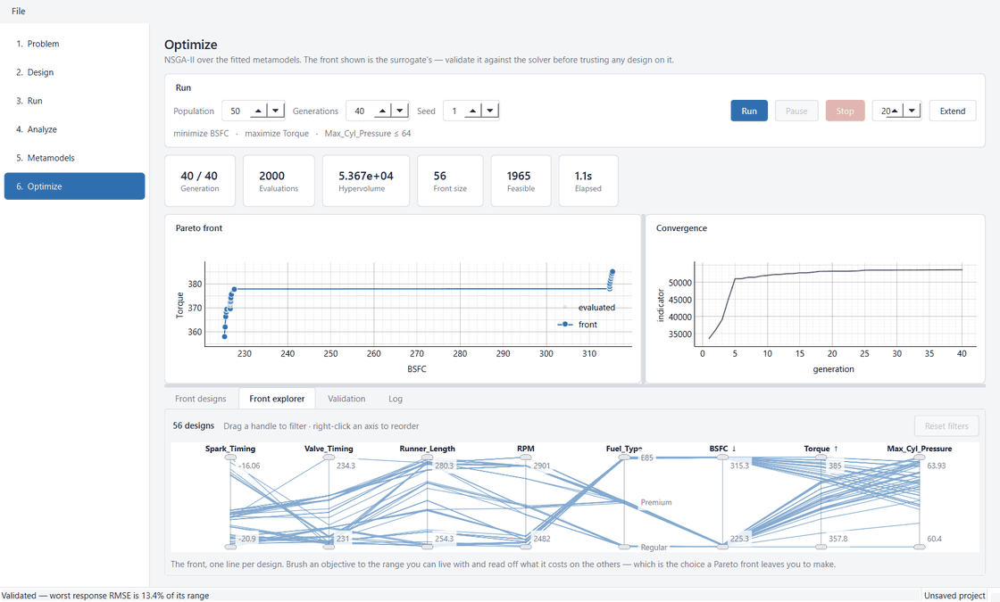

*The same widget on the front. Brush an objective to the range you can live with and read off
what it costs on the others — which is the choice a Pareto front leaves you to make.*

---

## 10 · Metamodels

> **Summary**
>
> A metamodel replaces the solver with something cheap enough to evaluate thousands of times
> per second, which is what makes population-based optimization practical. Three fit types in
> increasing order of flexibility and cost: **linear**, **quadratic**, and **kriging** (a
> Gaussian process).
>
> The number that matters is the gap between in-sample R² and **cross-validated** R². A high
> R² beside a poor CV R² means the surrogate has memorized the design rather than learned the
> response, and any optimum found on it will be fictional.

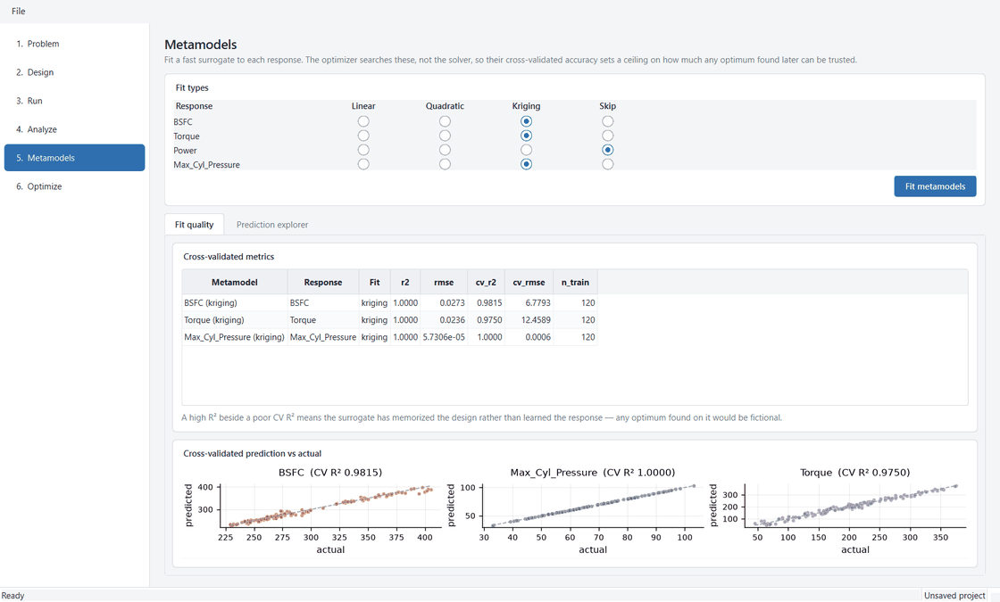

*One radio row per response, one column per fit type plus Skip. Ignored responses default to
Skip; everything the optimizer needs defaults to Quadratic.*

### The three fits

| Type | Model | Notes |
|---|---|---|
| **Linear** | Main effects only | Fast, and a useful baseline — if it already fits well, the response has no meaningful curvature. |
| **Quadratic** | `PolynomialFeatures(degree=2)` then least squares | The standard response-surface model, usually enough for a smooth engineering response. |
| **Kriging** | `Constant × Matern(ν=2.5) + White` | Interpolates the observed points and adapts its own smoothness per factor, so it captures shapes a polynomial cannot. Slowest to fit and most prone to overfitting a noisy design. |

### The pipeline

Every fit is an sklearn `Pipeline` beginning with the same `ColumnTransformer`:
`StandardScaler` on continuous factors, `OneHotEncoder(handle_unknown="ignore")` on
categorical ones. Standardizing matters for kriging, whose kernel measures distance in the
encoded space, and is harmless for the polynomial fits.

> **Redundant quadratic terms are tolerated, not excluded**
>
> Expanding one-hot columns to degree 2 reproduces the same two degeneracies
> [Chapter 4](#4--designs-of-experiments) excludes by hand from the D-optimal model matrix.
> Here they are left in: `LinearRegression` solves by least squares, which handles the
> resulting rank deficiency by taking the minimum-norm solution. They cost a little width but
> not accuracy — unlike in D-optimal, where a singular `XᵀX` would break the criterion itself.

**Kriging kernel choices:**

```python
kernel = ConstantKernel(1.0, (1e-3, 1e6)) * Matern(
    length_scale=1.0, length_scale_bounds=(1e-2, 1e3), nu=2.5
) + WhiteKernel(noise_level=1e-5, noise_level_bounds=(1e-8, 1e1))
```

- **Signal-variance bounds are wide.** Even with `normalize_y` the optimizer can want a scale
  well away from 1, and pinning it at a bound produces a visibly worse fit.
- **`alpha` is fixed jitter** on the covariance diagonal, distinct from the WhiteKernel's
  *learned* noise. An analytic solver is exactly interpolable, which drives the learned noise
  toward zero and leaves the covariance matrix ill-conditioned; a small jitter keeps the
  Cholesky factorization stable without pretending the data is noisy.

### Cross-validation

`KFold(shuffle=True, random_state=0)` with `n_splits = min(cv_folds, len(X) // 2)` —
cross-validation needs at least two samples per fold and cannot use more folds than there are
experiments. Below two splits the CV metrics are `NaN` and the parity panel says *"too few
runs to cross-validate"* rather than drawing an empty axis.

Four metrics per model: `r2`, `rmse`, `cv_r2`, `cv_rmse`, plus `n_train`.

### Warning triage

A Gaussian process fitted to a deterministic solver complains constantly, and cross-validation
multiplies each complaint by the fold count. Three fragments are classified as the ordinary
consequence of noiseless data and filtered out:

```
"noise_level is close to the specified lower bound"
"constant_value is close to the specified upper bound"
"lbfgs failed to converge"
```

None of these says anything about whether the surrogate predicts well — a response that is
very nearly linear provokes all three while cross-validating at R² = 1.0. Warnings are captured
with `warnings.catch_warnings(record=True)` and carried on the model as data the UI can
surface, rather than streaming to stderr. A banner that appears on every fit is one the user
learns to ignore.

What *is* surfaced is `is_weak`: cross-validated R² below `WEAK_FIT_THRESHOLD = 0.90`. Judged
on CV, not in-sample — kriging interpolates its training points exactly, so its in-sample R² is
~1.0 for any design and says nothing about generalization.

### The prediction explorer

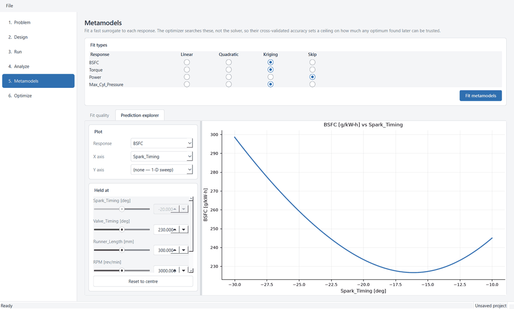

*Pick a response and one or two factors to sweep; every other factor is held at the value its
slider shows. Factors currently used as plot axes grey out — their slider would have no
meaning.*

- **One axis** selected gives a 1-D sweep at 120 points (a bar chart for a categorical factor,
  since a line would imply an ordering it does not have).
- **Two axes** give a 60×60 filled contour with labelled white iso-lines and a colour bar.
- Redraws are **debounced at 120 ms**. Dragging a slider fires continuously and a contour
  evaluates the surrogate over a few thousand grid points; coalescing means only the position
  the user settles on is rendered.
- `_restore_dtypes()` re-imposes per-factor dtypes after the grid is assembled through `object`
  arrays. The object route is what lets categorical labels survive; without the restore,
  continuous columns would stay object-typed and the scaler would reject them.

---

## 11 · Optimization and validation

> **Summary**
>
> NSGA-II over the fitted surrogates, with mixed variables declared natively — continuous
> factors as `Real`, categorical as `Choice`, so the genetic operators handle each type
> properly instead of forcing categories through a continuous encoding.
>
> The generation loop is driven explicitly rather than through pymoo's `minimize()` helper.
> Owning the loop is what makes **Pause, Stop and Extend real controls** instead of cosmetic
> ones.
>
> And then **Validate**, which exists because the optimizer searched the surrogate, not the
> solver — and cross-validation structurally cannot detect the failure that matters.

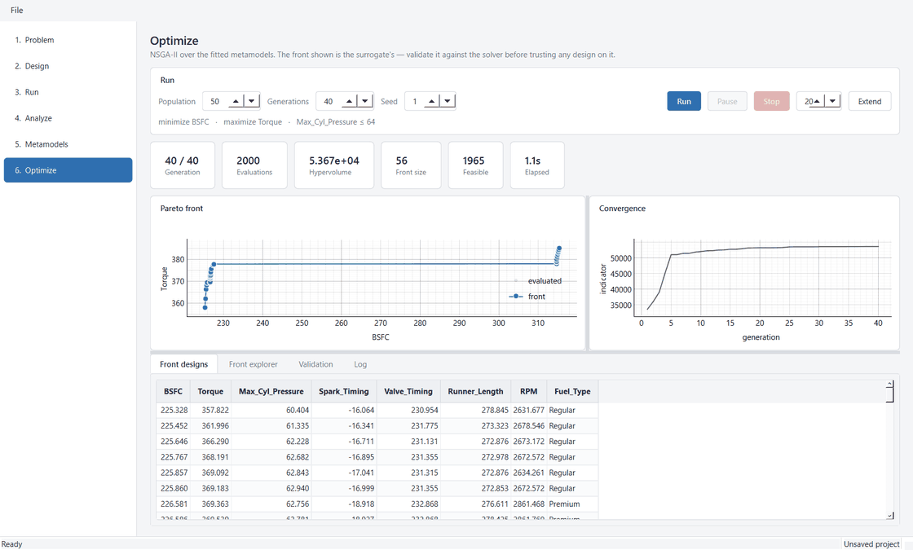

*Gasoline engine, kriging surrogates, population 50 over 40 generations: 2,000 evaluations in
1.1 seconds, 56 designs on the front.*

### The surrogate problem

```python
for f in space:
    variables[f.name] = (Choice(options=list(f.categories))
                         if f.is_categorical else
                         Real(bounds=(f.low, f.high)))
```

Evaluation is **batched, not elementwise**: pymoo hands over the whole population, which
becomes a single DataFrame and one vectorized `predict` per metamodel.

Two sign conventions are converted at the boundary and converted back for display:

- pymoo minimizes, so a maximized objective is searched on its negation. `_population_frame`
  undoes the flip so the table shows the response as the user defined it.
- pymoo's constraint convention is `g(x) ≤ 0`, so an upper bound becomes `prediction − upper`
  and a lower bound becomes `lower − prediction`. A two-sided constraint contributes both.

### Run control

Two `threading.Event` objects, no Qt anywhere:

| Control | Mechanism |
|---|---|
| **Pause** | `_running.clear()`; the loop blocks on `_running.wait()` at the top of each generation. |
| **Stop** | `_stop.set()` *and* `_running.set()` — so a **paused** run is released and can observe the stop flag and exit. |
| **Extend** | `_target_generations = _generation + extra`, measured from where the run now stands. |

> **Extend measures from the current generation, not the original target**
>
> After an early stop those differ. A run halted at generation 12 of 200 and then extended by 5
> should do 5 more generations, not 193.

### The convergence indicator

Hypervolume for two or more objectives; the best objective value for one. The reference point is
**fixed from the first generation's worst objective values** (×1.1) and never recomputed —
letting the reference drift each generation would make the trace non-monotonic, defeating its
purpose as a convergence signal.

### The Pareto front

`pareto_front()` takes non-dominated, *feasible*, deduplicated designs sorted by the first
objective. Feasibility is a precondition, not a tiebreak: a design that violates a constraint is
not a trade-off worth showing, however good its objectives look.

### Why validation exists

> ⚠️ **The failure cross-validation cannot see**
>
> The optimizer finds the optimum *of the surrogate*. The search pushes into regions the design
> sampled thinly — typically the corners of the space, which is exactly where optima like to
> sit — and there the metamodel is extrapolating. **Cross-validation cannot reveal this, because
> it only scores the surrogate where training data already exists.**
>
> Re-running the true solver on the handful of Pareto designs is cheap next to the thousands of
> surrogate evaluations the search consumed, and it is the only honest way to know whether the
> front is real.

`validate_pareto()` re-evaluates the front and adds `<response>_predicted`, `_actual` and
`_error` columns; `validation_summary()` reduces those to mean error, mean and max absolute
error, RMSE, and **RMSE as a percentage of the response's realized range** — the last being the
one comparable across responses with different units.

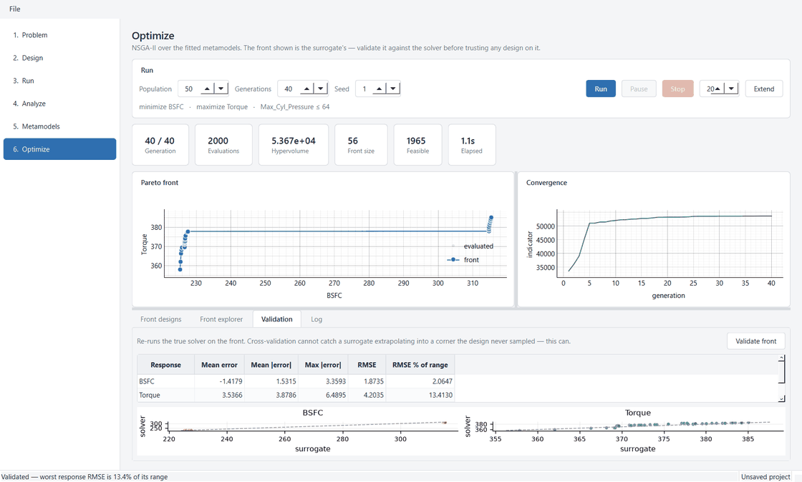

*Points off the dashed diagonal are places the surrogate promised something the solver does not
deliver.*

---
---

# Part III — The implementation

How the two layers are kept apart, how the interface is put together widget by widget, and
what the test suite is actually holding in place.

---

## 12 · Architecture

> **Summary**
>
> Two packages. `engine/` is pure Python with **no Qt imports at all** — fully testable
> headless and safe to run on a worker thread. `ui/` is a thin PySide6 client over it. The
> boundary is asserted by a test that walks each engine module's import graph, because it
> erodes silently: one convenient `QObject` import and the engine needs a running application
> to import.
>
> Long operations run on a `QThread` and deliver results through a **relay object owned by the
> UI thread**. Connecting a worker signal straight to a plain callable gives Qt no receiver, so
> it cannot determine a target thread and invokes the callback *on the worker* — which is not
> safe for code that touches widgets.

```
src/doelab/
  engine/      pure Python, no Qt imports at all — fully testable headless
    factors.py    doe.py      solver.py    analysis.py
    metamodel.py  optimize.py parallel.py  project.py
  ui/          PySide6, a thin client over the engine
    main_window.py  workers.py  theme.py
    pages/     problem  design  run  analyze  metamodel  optimize
    widgets/   tables  plots  parallel  editors  controls

  ────── test_layering.py: no PySide6 / pyqtgraph / matplotlib in engine/ ──────

THREAD BOUNDARY
  QThread + Worker  ->  Qt signal  ->  _Relay (owned by UI thread)  ->  widgets
  A signal connected to a bare callable runs it ON THE WORKER.
  The relay is a QObject, so Qt queues it to the right thread.
```

### The layer test

It parses each engine module with `ast` and intersects its top-level import roots with a
forbidden set — `PySide6`, `PyQt5`, `PyQt6`, `shiboken6`, `pyqtgraph`, `matplotlib`.
Parametrized over `ENGINE_DIR.glob("*.py")`, so a new engine module is covered the moment it
exists, with no registration step to forget.

The rule is not stylistic. It buys three things: the engine is testable without a display, it
can be run on a worker thread without Qt affinity questions, and any part of it could be lifted
into a script or a notebook unchanged.

### Threading

Every long operation goes through one function:

```python
run_async(fn, on_finished, on_failed=None, on_progress=None, *args, **kwargs) -> Task
```

It creates a `QThread`, moves a `Worker` onto it, and wires the worker's signals to a `_Relay`.
Four subtleties are load-bearing:

| Piece | Why it exists |
|---|---|
| `_Relay` | Exists solely to give Qt a receiver **object**. Connecting a signal to a plain Python callable leaves Qt unable to determine a target thread, so it invokes the callback directly — on the worker. Every completion handler here touches widgets. |
| `Task` | Held by the caller so Python does not garbage-collect the `QThread` the moment the call returns, tearing down a running thread mid-operation. It also holds the relay, since dropping it would silently disconnect the callbacks. |
| `DirectConnection` | `worker.finished -> thread.quit` must be **direct**. The `QThread` object lives in the calling thread, so an automatic connection would *queue* `quit()` back to it — and shutdown blocks that thread inside `wait_for_all()`, so the quit would never be delivered and the wait would never return. `QThread.quit` is documented thread-safe. |
| `_ACTIVE` | A module-level set of in-flight tasks. Qt aborts the process if a `QThread` is destroyed while still running, so the application must be able to find outstanding work and wait for it before tearing anything down. |

`closeEvent` therefore calls `page.shutdown()` on every page — which for the Optimize page sets
the run's stop flag and releases its pause gate — and then `wait_for_all(15_000)`.

Exceptions inside a worker are caught, formatted with a traceback, and emitted on a `failed`
signal. Every page's failure handler releases the busy lock before showing the message; without
that release, a single failed operation would leave navigation disabled for good. That is
asserted by a test.

### Persistence

A project saves to a single JSON file, suffix `.doelab.json`, with a `version` field that
refuses to load a file newer than the build supports.

> **Fitted estimators are never serialized**
>
> Only `MetamodelSpec`s are written, and models are **refit from the stored experiments on
> load**. Refitting costs a second or two; pickling scikit-learn estimators would tie saved
> files to the exact library version that wrote them.

DataFrames are stored per column via `tolist()` — the step that converts numpy scalars into
native Python types. Dumping `values` wholesale would leave numpy types the JSON encoder rejects.

### The fit-then-commit split

`Project.build_metamodels()` fits and returns without storing; `adopt_metamodels()` commits. The
split exists because fitting runs on a worker thread: fitting and storing in one step would leave
the project mutated from another thread before any observer had been told, so a reader could see
models attached to a study state that had not been published yet. `fit_metamodels()` does both,
for callers already on the owning thread.

---

## 13 · The user interface

> **Summary**
>
> A `QMainWindow` holding a fixed navigation rail and a `QStackedWidget` of six pages. Every
> page subclasses one `Page` base that supplies the heading, the subtitle, three signals, and
> the busy flag — and pages never reach for the project themselves, so a page's displayed state
> is always a function of the project as it stands when the page is shown.
>
> Underneath sit five widget modules: read-only data tables with three shading modes, editable
> factor and response tables, typed factor controls, a plotting layer deliberately split between
> two libraries, and the parallel coordinates view.

### The shell

1440×900 at launch, minimum 1100×700. The rail is a fixed 210 px `QListWidget`; pages are added
to a `QStackedWidget` in the same order.

- **Clicking a blocked stage bounces back.** `_on_rail_changed` checks `project.blocker(stage)`
  first, and on a hit posts the reason to the status bar and restores the previous row with
  signals blocked — rather than showing a page that cannot function.
- **Opening a saved project lands on the furthest reachable stage**, so reopening finished work
  does not start the user back at step one.
- **Busy locks the rail.** `_on_busy_changed` disables it while *any* page reports busy.
- **Project changes re-render the current page**, skipping the page that raised the change since
  it renders itself — avoiding a double draw.

The File menu carries New / Open / Save / Save As / Exit on the standard key sequences, and the
status bar holds a message on the left and the project path permanently on the right.

### The Page base

```python
class Page(QWidget):
    project_changed = Signal()      # the rail must re-evaluate reachability
    status_message  = Signal(str)
    busy_changed    = Signal(bool)

    stage: Stage;  title: str;  subtitle: str

    def bind(self, project): ...    # set and refresh
    def refresh(self): ...          # rebuild from current project state
    def shutdown(self): ...         # ask any started work to stop
```

> **Publish before rendering**
>
> Every completion handler emits `project_changed` *before* calling `refresh()`. The project
> state is already committed at that point, so the navigation rail must learn about it even if
> drawing the scatter then fails.

Three shared building blocks: `Card` (a titled panel), `FieldRow` (a labelled horizontal control
row, whose `spacer()` uses a stretch rather than a filler widget — a bare `QWidget` inherits the
window background and reads as a stray grey panel against a card), and `BlockedNotice`.

### Data tables

`DataFrameModel` is a read-only `QAbstractTableModel` over a DataFrame, shared by every numeric
view in the app. Converting each frame into `QTableWidgetItem`s would copy every cell and fall
over on the thousands of rows an optimization produces.

| Shading mode | Scale | Used by |
|---|---|---|
| `None` | — alternating row colours instead | Results, front designs, metrics, validation |
| `"diverging"` | Fixed `[−1, 1]`; blue negative, red positive, white at zero | Correlations — sign carries as much meaning as magnitude, so a single-hue ramp would hide half the information |
| `"sequential"` | Each column's own min–max | Factor sensitivity *(mis-scaled — see Ch. 6)* |
| `"fraction"` | Fixed `[0, 1]` | Partial R² |

Formatting rules: `NaN` renders as empty rather than the string "nan"; booleans as yes/no; and
magnitudes at or above 1e6 or below 1e-4 switch to scientific notation rather than printing a
wall of zeros or truncating to nothing. Numbers align right, text left.

### Editable tables

The factor and response tables edit the engine's dataclasses *in place*, and are deliberately
**shape-preserving**: factors cannot be added, removed or retyped, because the analytic problem
defines its own inputs — a factor the solver has never heard of could not be evaluated.

- **The factor table is type-aware.** A continuous row edits min/max/levels; a categorical row
  edits its level list. The cells that do not apply are *inert* rather than merely ignored —
  greyed with `_INERT_BACKGROUND` and carrying a tooltip explaining why — so the table never
  invites an edit it will discard.
- **Validation happens through the dataclass.** Editing a category list rebuilds a
  `CategoricalFactor` so its own uniqueness and count checks run; `setData` returns `False` on a
  bad value, and Qt reverts the cell.
- **Role changes seed a bound.** Setting a response to Constrain with no bound writes
  `upper = 0.0`, rather than leaving an invalid response the optimizer would later reject. Bound
  cells change editability with the role, and the model emits `dataChanged` across both so the
  greying updates immediately.
- `RoleDelegate` presents the role as a combo box of readable verbs — Minimize, Maximize,
  Constrain, Ignore.

### Factor controls

Each factor's control follows its type: continuous gets a slider paired with a spin box (1,000
slider steps, kept in sync through an `_updating` re-entrance guard), categorical gets a combo
box. Forcing a category onto a slider would imply an ordering and a midpoint a nominal factor
does not have. `FactorControlPanel.set_axis_factors()` greys out whichever factors are currently
plot axes.

### The plotting split

| Library | Used for | Why |
|---|---|---|
| **matplotlib** | Design scatter, sensitivity and variance bars, parity plots, contour and sweep, validation | Static figures redrawn on a discrete user action. Better typography and contour support. |
| **pyqtgraph** | Live Pareto front, convergence curve, parallel coordinates | Updates continuously — every generation, or every mouse move during a brush drag. |

> **Redraws are synchronous, deliberately**
>
> `MplCanvas` calls `draw()`, never `draw_idle()`. Deferring the render to the event loop opens a
> window in which the figure can be cleared and repopulated before the queued draw runs; the
> constrained-layout engine then walks artists that `clear()` has already detached — they have no
> axes left — and raises deep inside the layout pass. Every plot here is redrawn in response to a
> discrete action, so drawing immediately costs nothing and removes the race entirely.
>
> `reset_figure()` also re-seats the layout engine, dropping any state cached against the axes
> just removed.

### Inside the parallel coordinates widget

The most involved widget in the app, at 654 lines. Its engine-side geometry is covered in
[Chapter 9](#9--the-design-explorer); what follows is the drawing.

**One item per group, not per design.** All the polylines in a group are drawn as a **single**
`pg.PlotDataItem` using its `connect` array — a `uint8` array with a zero after each design's
last point, telling the renderer to lift the pen rather than run on into the next design's first
axis:

```python
connect = np.ones(ys.size, dtype=np.uint8)
connect[width - 1 :: width] = 0
# A segment needs both ends placed; an axis that could not place a
# design leaves a gap instead of a line drawn to nowhere.
finite = np.isfinite(ys)
connect &= finite
connect[:-1] &= finite[1:]
return {"x": xs, "y": np.nan_to_num(ys, nan=0.5), "connect": connect}
```

Giving every design its own item is the usual way this plot ends up unusable: brushing redraws on
each mouse move, and per-item overhead makes that cost grow with the design count. Here a redraw
is three `setData` calls no matter how many designs there are. Six z-ordered items in total:

| z | Item | Style |
|---:|---|---|
| 1 | `_muted` | grey `(170,176,186,90)` — filtered out; visible, not readable |
| 2 | `_spines` | the axis lines |
| 3 | `_passing` | accent blue `(47,111,176,150)` |
| 4 | `_violating` | rust `(201,82,44,165)` |
| 5 | `_rails` | dashed constraint bounds |
| 6 | `_highlight` | the design under the cursor |

Line colours are semi-transparent on purpose: a hundred opaque lines over nine axes is a solid
block, whereas with alpha the overlap density reads as tone — where many designs follow the same
path the bundle darkens, which is most of what the plot has to say.

**AxisBrush.** A `pg.GraphicsObject` subclass per axis, painting two handle pills and shading the
excluded bands. `pg.LinearRegionItem` is not usable here: a region item spans the entire plot
width, and confining one to a single axis would mean giving each axis its own `ViewBox` — but the
polylines have to cross those boundaries, which is the whole point of the plot.

- `boundingRect` is **constant**. Handles are drawn at a pixel size that varies with the widget
  (via `pixelLength(pg.Point(...))`), but a rect that changed with it would need a geometry update
  on every resize for no benefit.
- `mouseDragEvent` grabs whichever handle is nearer the grab point on `isStart()`, then clamps to
  `[0, 1]` and to the other handle.
- Right-click emits `menu_requested` with the screen position.

**Hover.** `scene().sigMouseMoved` → view coordinates → the axis pair the cursor falls between →
a **vectorized** linear interpolation of every design's height at that x → nearest within
`HOVER_REACH = 0.02`. One numpy operation per mouse move. The readout is parked on the far side of
the plot from the cursor — nine lines of values cover an axis wherever they land, so the one to
cover is the one furthest from what the user is pointing at.

**Reordering.** Right-click gives Move left / Move right / Hide \<name\> / Show all, original
order, with each entry disabled when it would do nothing. `_reorder()` carries the brushed bands
over by *parent axis index*: reordering asks a question about adjacency, not about which designs
matter, and a plot that silently dropped the filters when an axis moved would make the two
impossible to use together.

**Two layout survival tactics.** On the Optimize page the widget lives in a splitter pane that can
be very short, and a `QSplitter` will overrule a minimum height when the window has no space left
to give. So the layout stays legible by *needing little* rather than by demanding a lot:

- **End-value labels are tucked inside the axis tips** rather than given rows of their own. Two
  more label rows is height the axes need more, and the extremes of an axis are where the fewest
  lines run.
- **The Parameters/Responses group band drops out below 210 px.** Three rows of labels above the
  axes will not fit legibly in a short pane, and the factor/response split is the one the axis
  order already implies. `resizeEvent` rebuilds *only* when that verdict flips — rebuilding on
  every resize step would throw away the user's brushed bands mid-drag of a splitter.

Labels inside the plotting area are knocked out with a `fill=(255,255,255,200)` background: grey
text on a dense bundle is unreadable exactly where the bundle is most interesting.

> ⚠️ **An import-order trap**
>
> The widget sets `self._plot.setBackground("w")` explicitly. `plots.py` calls
> `pg.setConfigOptions(background="w")` as an *import side effect*, so any page reaching this
> widget without touching that module got a black plot. Stated locally rather than relied upon.

### Theme

A single light palette in one `STYLESHEET` f-string, stated explicitly rather than inherited from
the platform. This is load-bearing: cell shading in the analysis tables assumes a light
background, and letting the OS supply a dark one would make that shading unreadable.

```
ACCENT     #2f6fb0      BACKGROUND #f4f5f7
SURFACE    #ffffff      BORDER     #d8dbe0
TEXT       #1f2430      MUTED      #6b7280
```

Widgets are styled by `objectName` — `pageHeading`, `pageSubtitle`, `cardTitle`, `fieldLabel`,
`metricValue`, `metricLabel`, `warningLabel`, `card`, `navRail`, `primary`, `danger`,
`matrixChoice`. Qt resolves stylesheet `url()` against the filesystem and CSS wants forward slashes
even on Windows, so the checkbox glyph path is built with `as_posix()`.

---

## 14 · Testing

> **Summary**
>
> **214 tests** across nine files, running in about 100 seconds. The engine tests are headless and
> fast; the UI suite drives the real `MainWindow` through the whole workflow under Qt's offscreen
> platform.
>
> Two categories are worth calling out. Several tests exist to pin **documented limitations** in
> place, so a known blind spot cannot regress into a silent wrong answer. And one test suite covers
> what the offscreen platform *cannot* check, having previously hidden a real styling bug.

| File | Tests | Covers |
|---|---:|---|
| `test_ui_smoke.py` | 34 | The shell, the full pipeline, invalidation, rail gating, busy locking, persistence through the UI, the design explorer, indicator styling |
| `test_solver_analysis.py` | 33 | The four problems, noise, factor sensitivity, variance decomposition, correlation |
| `test_parallel.py` | 26 | Axis building and scaling, normalization, filter masks, feasibility, rails |
| `test_factors.py` | 23 | Factor validation, coding, the unit-cube mapping, round-tripping |
| `test_metamodel.py` | 22 | The three fits, cross-validation, warning triage, grid and sweep prediction |
| `test_doe.py` | 21 | All three generators, model matrices, D-efficiency |
| `test_optimize.py` | 21 | NSGA-II convergence, run controls, Pareto extraction, validation |
| `test_project.py` | 20 | Stage gating, invalidation, JSON round-trip, refit-on-load |
| `test_layering.py` | 1 | Parametrized over every engine module: no GUI imports |

### Tests that pin limitations

- `test_is_blind_to_a_symmetric_quadratic_effect` — sensitivity scores a pure symmetric quadratic
  below 0.2. The docstring says it plainly: *"A documented limitation, asserted so it cannot
  regress silently."*
- `test_confounded_factors_score_low_apart_and_high_together` — a near-copy factor with no real
  effect; both semi-partials below 0.1 while `shared` exceeds 0.9.
- `test_an_orthogonal_design_leaves_nothing_shared` — the identity that makes the previous test
  meaningful.
- `test_spearman_detects_a_monotonic_relationship_pearson_understates` — the reason both
  correlations are reported.
- `test_zdt1_front_satisfies_its_analytic_identity` — convergence against a known answer, not
  merely completion.

### What the offscreen platform cannot see

> ⚠️ **A bug the suite once hid**
>
> `QT_QPA_PLATFORM=offscreen` selects a different base style from the Windows one, which is what
> let a broken checked-radio indicator pass the entire suite. `TestIndicatorStyling` now asserts on
> the stylesheet text and the shipped glyph asset directly, rather than on rendered pixels.
>
> The rule that follows: **visual verification runs on the real platform, not headlessly.** The
> parallel coordinates work was checked at 1440×900 and at the 1100×700 minimum, and at both
> axis-count extremes — Branin with 3 axes and ZDT1 with 8.

`TestDesignExplorer` is explicit about its own scope: only the wiring is asserted there, because
how the plot actually renders cannot be checked offscreen, and the axis arithmetic it depends on is
covered headlessly in `test_parallel.py`.

### UI test machinery

| Helper | Role |
|---|---|
| `pump()` | Spins the event loop until a predicate holds or a timeout expires — how the async workers are awaited without `sleep`. |
| dialog recorder | Records modal dialogs instead of showing them, so a failing path is asserted rather than hanging the suite on a message box. |
| `axis_menu` | A `QMenu` subclass that records what the context menu offered. It replaces the **module-level symbol** — `pcmod.QMenu = Recorder` — because PySide6 binds `QMenu.exec` from C++ and monkeypatching it on the class silently does nothing. |

---

## 15 · Limits and open questions

> **Summary**
>
> Four known issues, none of them blocking. Two are cosmetic-looking but change what a reader
> concludes; two are judgement calls about defaults that reasonable people would set differently.

### 1 · The sensitivity table's shading is mis-scaled

`"sequential"` rescales per column, but every cell is already a normalized share on a common
scale. Every column therefore always contains one pure-white and one full-blue cell regardless of
its actual spread, and a 0.15 can look darker than a 0.57 beside it. The `"fraction"` mode built
for partial R² is the fix; it has not been applied back. One line: `analyze_page.py:42`.

### 2 · The correlation tab hides the baseline categorical level

`correlation_matrix` calls `coded_matrix(drop_first=True)`. Reference coding is required wherever
a matrix gets inverted — it is not here. The cost is a hidden finding: Regular (−0.4462) and
Premium (−0.4604) behave near-identically against BSFC while E85 (+0.9066) is the whole effect, and
with Regular dropped the reader sees two of the three numbers that make that legible. Switching to
`drop_first=False` would give every level a row.

### 3 · The gasoline constraint leaves most of the design infeasible

`Max_Cyl_Pressure ≤ 64` excludes **66 of 120** designs in the default LHS, which makes the design
explorer mostly red and gives the optimizer a narrow feasible region to work in. This is arguably
correct — it is what makes the constraint bind and cut the front — but it is aggressive as a
first-run default, and a newcomer's first look at the explorer is a wall of violations.

### 4 · Two thresholds set by judgement

`WEAK_FIT_THRESHOLD = 0.90` decides which surrogates get a warning banner, and
`_EXPECTED_WARNING_FRAGMENTS` decides which sklearn complaints are suppressed as the ordinary
consequence of noiseless data. Both are defensible and both are substring matching against library
messages, which is inherently brittle across scikit-learn versions.

### Things deliberately not built

- **Adding or removing factors.** The analytic problem defines its own inputs; a factor the solver
  has never heard of could not be evaluated.
- **Replicated runs in D-optimal.** Legitimate in classical design for estimating pure error,
  pointless against a deterministic solver.
- **Live front explorer updates.** The dashboard already owns the per-generation redraw, and a
  front moving under the user's brushes would make them impossible to aim.
- **A shared `Project.results_frame()` helper.** The design-plus-results concat appears in three
  places now; at two it did not yet justify lifting.

---
---

# Part IV — For newcomers

Every algorithm and term the rest of this document uses, explained from scratch. Nothing here
assumes a statistics background.

---

## 16 · The algorithms in plain terms

> **Summary**
>
> The whole workflow rests on one idea: **a small number of well-chosen experiments can stand in
> for a huge number of expensive ones.** Choosing them well is *design of experiments*. Learning a
> cheap approximation from them is *metamodeling*. Searching that approximation for the best
> trade-offs is *multi-objective optimization*.
>
> This chapter walks each algorithm the app uses, in order, with no formalism beyond what is needed
> to see what it is doing.

### Why design an experiment at all?

Suppose you can vary five knobs on an engine and each simulation takes an hour. Trying ten settings
of each knob would be 10⁵ = 100,000 runs, or about eleven years. You have budget for maybe a
hundred.

So the question is not *"what is the answer?"* but *"which hundred runs teach me the most?"* That is
the whole subject. A good design spreads its runs so that every knob's effect can be told apart from
every other knob's, and so that no region of the space is left completely dark.

The word for a knob is a **factor**; the word for something you measure is a **response**; one
setting of all the knobs is a **run** or **design point**; the table of all of them is the **design
matrix**.

#### Full factorial — try every combination

Pick a few **levels** for each factor (say low / medium / high) and run every possible combination.
Perfectly balanced, and every effect is cleanly separable. The catch is arithmetic: the run count is
the product of the level counts, so it explodes. Five factors at three levels is 243 runs; add a
sixth factor and it is 729.

#### Latin hypercube — spread out evenly, at any budget

Imagine a chessboard where you must place `n` rooks so that no two share a row or column. That is a
Latin square, and a **Latin hypercube** is the same idea in as many dimensions as you have factors.

Concretely: cut each factor's range into `n` equal slices, and place exactly one run in each slice
of each factor. You choose `n`, so it works at any budget, and every factor is guaranteed even
coverage of its own range.

> **The catch worth knowing early**
>
> LHS guarantees each factor is spread evenly *on its own*. It does **not** guarantee the factors
> are uncorrelated *with each other*. With 80 runs over 6 factors you can still find pairs
> correlated at 0.2 by chance — enough to muddle the question "which factor did this?". That is
> exactly the effect [Chapter 7](#ch7) makes visible as `shared`.

#### D-optimal — the best runs for a model you name in advance

This one works backwards. First you say what kind of model you intend to fit — main effects only, or
main effects plus interactions and curvature. Then the algorithm picks the runs that will let you
*estimate that model as precisely as possible*.

The measure of precision is `det(XᵀX)`, where `X` is the table of model terms evaluated at your
runs. A larger determinant means the runs pin the coefficients down more tightly; a determinant of
zero means some coefficient cannot be determined at all.

**Fedorov exchange** is how it searches: start from a random set of runs, then repeatedly find the
single swap — take one run out, put one candidate in — that improves the determinant most, and keep
swapping until nothing helps. Because a greedy search like this can get stuck, it restarts several
times from different random starts and keeps the best result.

The clever part is speed. Naively you would recompute a determinant for every possible swap, which
is thousands of matrix factorizations per iteration. Instead the app uses a **rank-one update**: a
formula that gives the *ratio* by which the determinant would change, computed for every possible
swap at once in a single matrix multiplication.

Use D-optimal when the run budget is fixed and you have a mix of continuous and categorical
factors — the situation where a factorial is unaffordable and an LHS does not target your model.

### Turning factors into numbers

Every statistical method here needs numbers. Two conversions do that work.

**Coding.** A continuous factor is rescaled to `[−1, 1]` — low end −1, high end +1. This puts a
factor measured in millimetres and one measured in RPM on the same footing, so their coefficients
are comparable.

**Reference (dummy) coding.** A categorical factor like `Fuel_Type ∈ {Regular, Premium, E85}`
becomes **indicator columns** — columns that are 1 when that level is present and 0 otherwise. One
level is left out as the **baseline**, and the remaining columns then read as "the difference from
the baseline".

Why leave one out? Because if you kept all three, they would always sum to exactly 1 — the same as
the intercept column — and the maths could not tell them apart. This is called perfect collinearity,
and it makes the model unsolvable.

### Fitting a straight line: least squares

**Ordinary least squares (OLS)** is the workhorse behind sensitivity, partial R², and the linear and
quadratic surrogates. It finds the coefficients that make the model's predictions as close as
possible to the observations, where "close" means the sum of squared errors is smallest.

Each coefficient — a **beta** (β) — is the weight the model gives that factor. When both inputs and
output have been **standardized** (mean subtracted, divided by standard deviation), the betas are
directly comparable to each other: a bigger beta means a bigger effect, full stop.

#### R² — how much did the model explain?

Start with the total variation in the response: how much it bounces around its own average. Then
look at what is left over after the model has had its say — the **residual**. R² is the fraction the
model accounted for:

```
R² = 1 − (leftover variation) / (total variation)
```

R² = 1 means perfect prediction; R² = 0 means the model does no better than always guessing the
average. R² = 0.24 means it explained about a quarter of what was going on — which sounds bad, and
is.

**Adjusted R²** subtracts a penalty for the number of terms fitted. Adding any term at all, even a
random one, can only push R² up; the adjustment asks whether it earned its place.

#### Partial and semi-partial R²

Both answer "how much did *this one factor* contribute?" by the same trick: fit the model, then fit
it again with that factor removed, and see how much worse it got. They differ only in what they
divide by.

- **Semi-partial** divides by the total variation: *"this factor uniquely accounts for 8% of the
  response."*
- **Partial** divides by what the other factors had already left unexplained: *"of the part nothing
  else could explain, this factor recovers 30%."*

Partial is always the larger of the two, because it divides by a smaller number.

### Correlation

A single number between −1 and +1 saying how strongly two columns move together. +1 is a perfect
rising line, −1 a perfect falling one, 0 no linear relationship at all.

- **Pearson** works on the values. It measures how close the relationship is to a *straight line*.
- **Spearman** does the identical calculation on the *ranks* (1st smallest, 2nd smallest, …). It
  measures whether the relationship is *consistently rising or falling*, straight or not.

Comparing the two is diagnostic. Strong Spearman with weak Pearson means "reliably increases, but
along a curve" — a warning that a straight-line model will not be enough.

> ⚠️ **Correlation is pairwise, and that is its weakness**
>
> Each correlation looks at exactly two columns and knows nothing about the rest. So if two factors
> happen to move together in your design, correlation will credit *both* with an effect only one of
> them has. Regression, which considers all factors simultaneously, does not make that mistake — see
> the worked demonstration in [Chapter 8](#8--correlation).

### Surrogates (metamodels)

A **surrogate** is a fast approximation of the expensive solver, learned from the runs you actually
did. Once you have one, you can evaluate millions of designs in seconds — which is what makes
optimization possible at all.

| Kind | What it assumes | When to use it |
|---|---|---|
| **Linear** | Each factor's effect is a straight line, and they simply add up. | As a baseline. If it fits well, there is no curvature to chase. |
| **Quadratic** | Adds squared terms (curvature) and pairwise products (interactions). | The default. Enough for most smooth engineering responses. |
| **Kriging** | Nothing about the shape — only that nearby points have similar values. | When the response is wiggly, or has ridges a polynomial cannot bend around. |

#### What kriging actually does

Kriging — a **Gaussian process** — starts from a single assumption: *points close together in the
factor space should have similar responses*. It then learns, from your data, how quickly "similar"
falls off with distance, separately for each factor. A prediction at a new point is a weighted
average of the observed points, with nearby ones counting more.

The **kernel** is the function encoding that falloff. The app uses **Matérn (ν = 2.5)**, which is
standard for engineering data because it allows a moderately rough surface rather than assuming an
implausibly smooth one. Its **length scale** is what the fit learns: a short length scale means the
response changes fast in that direction.

Kriging passes exactly through every point it was trained on. That is a strength — and a trap, which
the next idea exists to catch.

#### Overfitting and cross-validation

A model that passes exactly through your data has not necessarily learned anything: it may just have
memorised. Since it reproduces the training points perfectly, its in-sample R² is 1.0 no matter how
wrong it is everywhere else.

**k-fold cross-validation** tests that honestly. Split the runs into `k` groups. Hold one group
back, fit on the other `k−1`, and predict the held-out group — data the model has never seen. Rotate
until every run has been predicted while held out, then score. **Cross-validated R² is the number
that matters.** A large gap between in-sample and cross-validated R² is the signature of
memorisation.

> ⚠️ **And the one thing cross-validation cannot catch**
>
> It only ever scores the surrogate *where training data already exists*. When an optimizer pushes
> into a corner of the space your design never sampled, the surrogate is extrapolating and
> cross-validation has nothing to say about it. That is why the app has a separate **Validate** step
> that re-runs the true solver on the final answers.

### Multi-objective optimization

#### Dominance and the Pareto front

With one objective, "best" is obvious. With two that conflict — say minimise fuel consumption *and*
maximise torque — there is usually no single winner, so the question changes.

Design A **dominates** design B if A is at least as good as B on *every* objective and strictly
better on at least one. B is then simply worse, and can be discarded. But two designs where each
wins on a different objective dominate neither one another — both are legitimate answers.

The set of designs that nothing else dominates is the **Pareto front**. It is the honest output of a
multi-objective problem: not an answer, but the complete menu of the trade-offs actually available.
Choosing among them is a decision, not a calculation.

#### Genetic algorithms

A **genetic algorithm** searches by imitating breeding. Keep a **population** of candidate designs.
Each **generation**: score them, let the better ones become **parents**, produce children by
**crossover** (mixing two parents' settings) and **mutation** (nudging a setting at random), and let
the strongest survive into the next round.

It needs no gradients and no assumptions about shape, which is why it copes with categorical factors
and lumpy surfaces. It pays for that with evaluations — tens of thousands of them, which is only
affordable against a surrogate.

#### NSGA-II

The standard genetic algorithm for multiple objectives. It adds two ideas to the loop above:

- **Non-dominated sorting.** Rank the population in layers: everything nothing else dominates is
  front 1; remove it and repeat for front 2, and so on. Lower front number is better, which turns a
  multi-objective comparison back into a single ranking.
- **Crowding distance.** Within a front, prefer designs sitting in sparse regions over ones bunched
  together. Without this the population collapses onto one small stretch of the front and you lose
  the rest of the menu.

It is also **elitist**: parents and children compete together, so a good design can never be lost by
bad luck.

**Mixed variables** matter here. A categorical factor like fuel grade has no meaningful midpoint, so
"average of Regular and E85" is nonsense. This app declares categorical factors as `Choice` so
crossover picks one parent's value outright, rather than smuggling categories through a continuous
encoding.

#### Constraints

A limit that must be respected — here, peak cylinder pressure at or below 64 bar. The optimizer is
told about it in the standard form `g(x) ≤ 0`, and prefers feasible designs over infeasible ones
regardless of how attractive the infeasible ones look. A design that breaks a constraint never
reaches the front.

#### Hypervolume

How do you tell whether a whole front is improving? **Hypervolume** measures the area (in 2-D;
volume in more) enclosed between the front and a fixed **reference point** placed at a deliberately
bad corner. A front that pushes further out, or spreads wider, encloses more area. Plotted per
generation it becomes the convergence curve: when it flattens, the search has stopped finding
anything new.

The reference point must be *fixed* for this to work. If it moved with the population, the number
would no longer be comparable between generations.

### Reading a parallel coordinates plot

Scatter plots handle two variables. With nine you would need 36 of them. A **parallel coordinates**
plot instead stands every variable up as its own vertical axis, side by side, and draws each design
as a line connecting its value on each one.

Three things to know before you look at one:

1. **Read between neighbours only.** Lines staying parallel from one axis to the next mean those two
   variables move together; lines crossing in an X mean they trade off. Axes that are not adjacent
   tell you almost nothing — which is why moving an axis is the main thing you do with the plot.
2. **Density is information.** Lines are drawn semi-transparent, so where many designs follow the
   same path the bundle darkens. That shading is the shape of the data.
3. **Brushing asks a question.** Drag the handles on an axis to keep only designs within a range;
   brush several axes and the filters combine. Excluded designs fade to grey rather than vanishing,
   because "these twenty" means nothing without the hundred they came from.

---

## 17 · Glossary

| Term | Meaning |
|---|---|
| **Adjusted R²** | R² with a penalty for the number of model terms. Guards against the fact that adding terms can only ever raise plain R². |
| **Beta (β)** | A regression coefficient — the weight a model gives one factor. Comparable across factors only when the columns have been standardized. |
| **Brushing** | Dragging handles on a parallel-coordinates axis to filter to a range. Several brushed axes intersect. |
| **Coded variable** | A factor rescaled to `[−1, 1]` so factors in different units are comparable. |
| **Confounding** | When two factors move together in a design, so their separate effects cannot be told apart. Surfaces as `shared` in the variance decomposition. |
| **Constraint** | A response that must stay within bounds. Violating designs never reach the Pareto front. |
| **Crossover** | The genetic operator that builds a child design by mixing two parents' factor settings. |
| **Crowding distance** | NSGA-II's tiebreak within a front: prefer designs in sparse regions, to keep the front spread out. |
| **Cross-validation** | Scoring a model on data it was not trained on, by rotating a held-out fold. The honest measure of a surrogate. |
| **D-efficiency** | `det(XᵀX)^(1/p) / n` — a scale-free score for comparing designs of the same model form. |
| **D-optimal** | A design chosen to maximize `det(XᵀX)` for a named model, so that model's coefficients are estimated as precisely as possible. |
| **Design matrix** | The table of runs: one row per experiment, one column per factor. |
| **Dominance** | Design A dominates B if it is at least as good on every objective and strictly better on one. |
| **Factor** | An input a design varies. Continuous (a real range) or categorical (named levels). |
| **Fedorov exchange** | The greedy swap algorithm that builds a D-optimal design. |
| **Full factorial** | Every combination of every factor's levels. Exhaustive; grows as the product of the level counts. |
| **Gaussian process** | See *Kriging*. |
| **Generation** | One breed-and-select cycle of a genetic algorithm. |
| **Hypervolume** | The area or volume a Pareto front encloses against a fixed reference point. The convergence measure for two or more objectives. |
| **Indicator column** | A 0/1 column marking whether one categorical level is present. |
| **Interaction** | When one factor's effect depends on another's setting. Modelled as the product of two coded columns. |
| **Kriging** | A Gaussian-process surrogate. Assumes only that nearby points have similar responses, and learns the falloff rate per factor. Interpolates its training points exactly. |
| **Latin hypercube (LHS)** | A space-filling design placing exactly one run in each equal slice of each factor's range. Stratifies each factor independently — it does not orthogonalize them. |
| **Least squares (OLS)** | Fitting by minimizing the sum of squared prediction errors. |
| **Level** | One discrete setting of a factor. Continuous factors get evenly spaced levels; categorical factors are their levels. |
| **Matérn kernel** | The similarity function kriging uses here. `ν = 2.5` permits a moderately rough surface rather than an implausibly smooth one. |
| **Metamodel** | See *Surrogate*. |
| **Non-dominated sorting** | Ranking a population into successive Pareto layers, turning a multi-objective comparison into a single ranking. |
| **NSGA-II** | Non-dominated Sorting Genetic Algorithm II — the multi-objective optimizer used here. |
| **Objective** | A response the optimizer minimizes or maximizes. |
| **Orthogonal** | Factor columns that are mutually uncorrelated. Under orthogonality, unique contributions sum exactly to R². |
| **Overfitting** | Fitting the noise as well as the signal. Shows up as high in-sample R² beside poor cross-validated R². |
| **Parallel coordinates** | A plot giving each variable its own vertical axis and each design one polyline crossing them all. |
| **Pareto front** | The set of designs nothing else dominates — the complete menu of available trade-offs. |
| **Partial R²** | Of the variation the other factors leave unexplained, the share this one recovers. |
| **Pearson correlation** | How close two variables are to a straight-line relationship, in `[−1, 1]`. |
| **Population** | The set of candidate designs a genetic algorithm carries from one generation to the next. |
| **Reference coding** | Expanding a categorical factor to indicator columns with one level left out as a baseline, so the columns stay linearly independent. |
| **Reference point** | The fixed bad corner hypervolume is measured against. Must not drift, or the trace stops being comparable. |
| **Residual** | What a model failed to predict: observed minus fitted. |
| **Response** | An output the solver computes. Carries a role: minimize, maximize, constrain, or ignore. |
| **Response surface** | The shape a response makes over the factor space. |
| **R²** | The fraction of a response's variation a model accounts for. 1 is perfect; 0 is no better than the average. |
| **Run** | One experiment: one setting of every factor, and the responses it produced. |
| **Semi-partial R²** | The share of the *whole* response a factor uniquely accounts for. The drop in R² when it is removed. |
| **Sensitivity** | Here: squared standardized betas normalized to sum to 1 across factors. |
| **Shared variation** | Variation a model explains but cannot attribute to any single factor, because the design moved several together. |
| **Spearman correlation** | Pearson correlation computed on ranks. Detects any consistently rising or falling relationship, curved or not. |
| **Standardize** | Subtract the mean and divide by the standard deviation, putting every column on a common scale. |
| **Stratified** | Sampled so that every equal slice of a range gets its fair share of runs. |
| **Suppression** | The case where unique contributions sum to *more* than the model's R², so `shared` goes negative. A strong sign of correlated factors. |
| **Surrogate** | A fast learned approximation of an expensive solver. What the optimizer actually searches. |
| **Validation** | Re-running the true solver on the optimizer's answers, to check the surrogate was not extrapolating. |
| **Variance** | How much a set of numbers spreads around its own average. |

---

*DOE Lab v0.1.0 · 9,604 lines of Python · 214 tests.
Reference values throughout are from the gasoline engine problem, 120-run Latin hypercube at
seed 42. Screenshots captured on Windows at 1400×880.*
